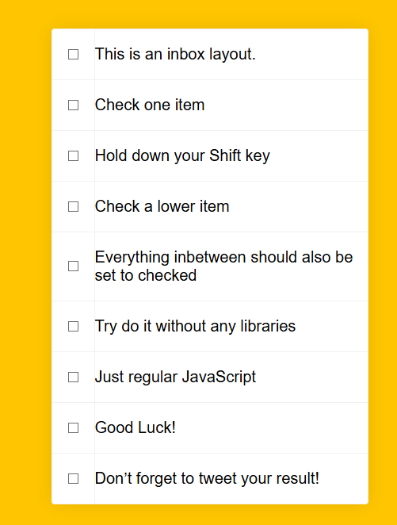
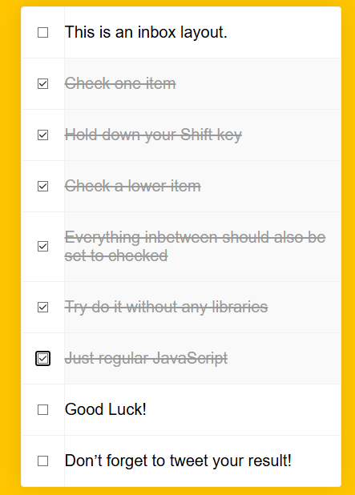

# 🟨 Reto JS — Hold Shift to Check Multiple Checkboxes  
**Tarea 7: Reto básico JS – JavaScript30 Challenge**

---

## 🧾 Descripción General

Como parte del desarrollo de habilidades en JavaScript moderno y buenas prácticas de ingeniería web, este proyecto consiste en seleccionar uno de los retos del sitio **https://javascript30.com**, replicarlo y documentarlo correctamente.  
El objetivo es evaluar la capacidad para comprender, adaptar e implementar lógica en **JavaScript sin frameworks**, además de demostrar dominio en control de versiones, documentación técnica y despliegue web.

---

# 📌 1. Nombre del reto seleccionado
**“Hold Shift to Check Multiple Checkboxes” — Día 10 de JavaScript30**

---

# 📄 2. Descripción breve del objetivo del reto

Este reto tiene como objetivo implementar una funcionalidad que permite seleccionar múltiples checkboxes utilizando la tecla **Shift**, de forma similar a cómo funcionan aplicaciones como Gmail.  
El ejercicio desarrolla habilidades de manejo del DOM, eventos de teclado y control lógico utilizando únicamente **JavaScript puro**, sin librerías externas.

---

# 🛠 3. Tecnologías utilizadas
- **HTML5**
- **CSS3**
- **JavaScript (Vanilla JS)**
- **Git & GitHub**
- **Vercel (Deploy)**

---

## 📸 4. Capturas de pantalla o GIF del funcionamiento

### Vista inicial del proyecto


### Selección múltiple con Shift



---

# 📂 5. Estructura del proyecto

/

├── index.html # Página principal

├── style.css # Estilos del proyecto

├── script.js # Lógica JavaScript

├── assets/ # Capturas o imágenes

└── README.md # Documentación del proyecto


---

# 🚀 6. Instrucciones para ejecutar el proyecto localmente

1. Clona el repositorio:

```bash
git clone https://github.com/RFelipeGR/Tarea7RetoB-sicoJS.git
```

Ingresa a la carpeta del proyecto:

```bash
cd Tarea7RetoB-sicoJS
```

Abre el archivo principal en tu navegador:

```bash
index.html
```

✔ No requiere instalaciones adicionales
✔ Funciona en cualquier navegador moderno

---

🌐 7. Link del despliegue (Deploy)
```bash
🔗 https://tarea7-reto-b-sico-js.vercel.app
```

---


🧩 8. Explicación de la lógica principal (JavaScript)
Seleccionar todos los checkboxes:
```bash
const checkboxes = document.querySelectorAll('.inbox input[type="checkbox"]');
```

Guardar el último checkbox seleccionado:

```bash
let lastChecked;
Detectar clic con Shift presionado:
js
Copiar código
if (e.shiftKey && this.checked) {
  // lógica para seleccionar el rango
}
```

Marcar los elementos entre el primero y el último seleccionado:
```bash
let inBetween = false;

checkboxes.forEach(checkbox => {
  if (checkbox === this || checkbox === lastChecked) {
    inBetween = !inBetween;
  }
  if (inBetween) {
    checkbox.checked = true;
  }
});
```

Actualizar cuál fue el último checkbox clickeado:
```bash
lastChecked = this;
```

---


👤 9. Autor
```bash
Roberto Felipe Guaña Romero
```

---


📚 10. Fuente oficial
Curso JavaScript30 – Wes Bos
```bash
https://javascript30.com
```

---
